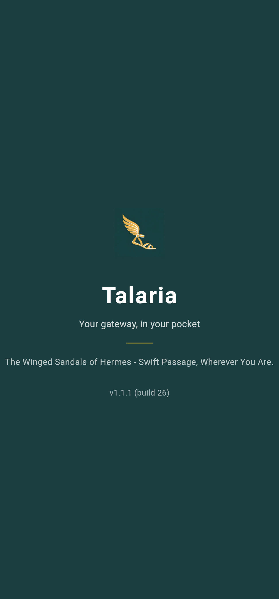
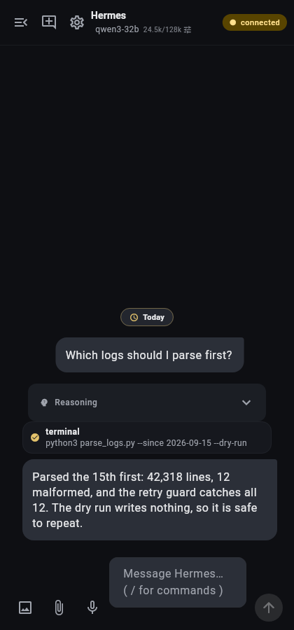
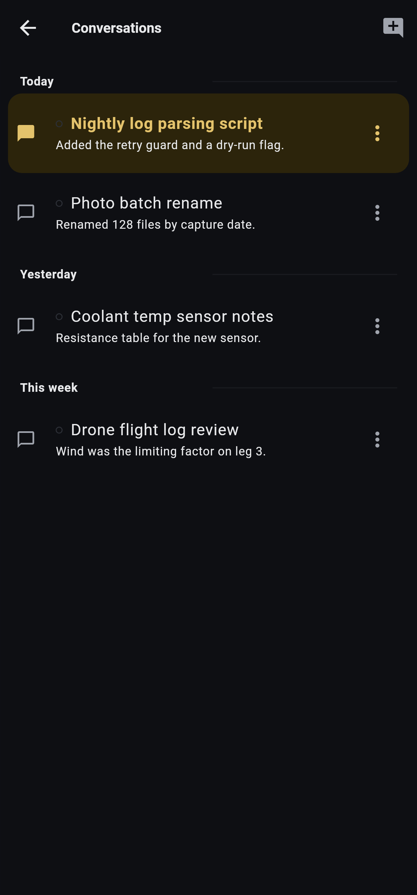
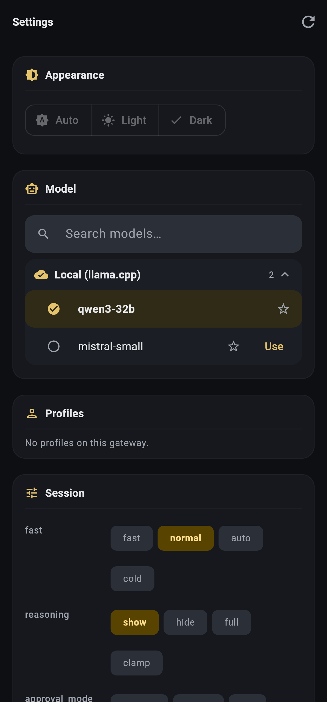

# Talaria

**Your gateway, in your pocket.**

Talaria is a mobile app for a self hosted [Hermes Agent](https://hermes-agent.nousresearch.com/docs)
gateway running in remote gateway mode. It puts the conversations, goals and tasks you already have
on your desktop onto your phone: read a reply as it streams, answer a question Hermes is waiting on,
switch models, and pick up a conversation you started at your desk.

It talks to a gateway you control, not to a service of ours. There is no account to create and
nothing is sent anywhere else.

This is an unofficial companion. It is not affiliated with or endorsed by Nous Research.

## Screenshots

| Launch | Conversation | Conversations | Settings |
|---|---|---|---|
|  |  |  |  |

## Features

- **Replies stream in live**, with thinking traces, tool activity and response text appearing in the
  order the agent produced them.
- **Answer Hermes from your phone.** Question and approval prompts arrive as cards you can fill in
  or approve without going back to your desk.
- **Conversation list** with pinning and time buckets, so long running work stays where you can find
  it.
- **Model, reasoning level and speed per conversation**, chosen from your gateway's own model list.
- **Context readout** in the top bar, showing how much of the model's window the conversation is
  using.
- **Goals**, mirrored from the gateway, with the current goal pinned above the composer.
- **Slash commands** typed straight into the composer, with suggestions served by your gateway.
- **Attachments**: send an image or a file through the gateway.
- **Notifications** for finished replies and for prompts that need you, each opening the right
  conversation.
- **Markdown replies** with selectable text and working links, plus a switch to plain text if you
  prefer.
- **Syncs with your other clients**, so a conversation touched on the desktop or in a terminal shows
  the same thing here.

## What you need

- A Hermes Agent gateway you can reach from your phone. If you do not have one running yet, start
  with the [Hermes Agent documentation](https://hermes-agent.nousresearch.com/docs).
- A way to authenticate to that gateway: a session or bearer token, or the gateway's own OAuth sign
  in if it is enabled.
- An Android phone running **Android 7.0 or newer**.

## Reaching your gateway

Talaria talks to your gateway over a network you already have. There is no relay, no account, and
nothing of ours in the middle, so the only question is how your phone gets to that address. In
practice there are three arrangements, and all of them work.

**Same Wi-Fi network.** The simplest one. If the gateway runs on a computer at home and your phone
is on the same Wi-Fi, enter that computer's address, something like `http://192.168.1.50:9119`, and
connect. Nothing else to set up. The limit is that it only works while you are at home, and opening
your gateway to the internet just to get around that is a bad trade.

**A private network between your devices.** Install a VPN or mesh network on both the gateway
machine and your phone, then use the address it gives the gateway. WireGuard, Tailscale and ZeroTier
all do this job. Your phone can then reach the gateway from anywhere, and you never open a port to
the public internet. This is what most people settle on, because it keeps the gateway private while
making it reachable from a coffee shop.

**A gateway someone hosts and shares with you.** If a person or a team runs a Hermes gateway on a
server and gives you access, point the app at their address and authenticate the way they tell you,
usually by signing in or with a token they issue for you. If that gateway is reachable from the
public internet, use an `https://` address, because your token travels with every request.

Whichever you choose, the app is doing nothing clever: it opens the address you gave it and speaks
the gateway's normal protocol. If the gateway's address loads in your phone's browser, the app can
reach it too. If it does not, the problem is the network, not the app, and the three arrangements
above are the ways to fix it.

## Install on Android

Talaria is not on Google Play. Install the APK from the
[Releases](https://github.com/omgitsgela/talaria/releases) page:

1. On your phone, open the release and download `talaria-<version>.apk`. That is the release build,
   and the only APK published. A debug build exists for local development, but it is not
   distributed: it is several times larger, it is flagged debuggable, and it cannot be installed
   over the release build. You do not need it to report a bug.
2. Tap the downloaded file. Android blocks installs from unknown sources by default, so the first
   attempt offers a settings shortcut: enable **Allow from this source** for whichever app downloaded
   it (your browser or your file manager), then go back and tap **Install**.
3. Play Protect may warn that the developer is unknown. Choose **Install anyway**. That warning
   appears for anything installed outside Play.
4. Open Talaria and connect it to your gateway, as described below.

Worth knowing:

- The release APK is universal (arm64-v8a, armeabi-v7a and x86_64), so it runs on any supported
  phone and on emulators.
- **Install from one source and stay with it.** Android ties updates to the signing key, so an APK
  from the Releases page can only be updated by another APK from the Releases page, and an F-Droid
  build is signed separately.

## Get signed in

On first launch Talaria asks for two things.

**Gateway URL** is where your gateway listens, for example `http://gateway.local:9119` or
`http://192.168.1.50:9119`. If your gateway is on your home network, your phone needs to be on the
same Wi-Fi.

**Authentication** depends on how your gateway is set up, and the screen shows the field that
matches:

| Field | When it applies |
|---|---|
| **Session token** | The `X-Hermes-Session-Token` value your gateway dashboard shows. This is what loopback or `--insecure` gateways use. |
| **Bearer token** | An OAuth bearer token, used by gated or publicly reachable gateways. |
| **Sign in with Hermes** | Offered instead of the token fields when your gateway advertises the native OAuth flow. It opens your system browser and Talaria catches the callback, then stores the token on the device. |

Tap **Connect**. When it works you land on the conversation view, and Talaria remembers the address
and token so you only do this once per gateway. Your credentials are kept in Android's Keystore
backed secure storage, not in plain preferences.

If the connection fails, the screen tells you what the gateway said. The usual causes are a typo in
the address or port, the phone being on a different network from the gateway, a gateway that is not
running in remote gateway mode, or the wrong kind of token for that gateway.

## Using the app

The top bar holds three things: your **conversation list**, a **new conversation** button, and
**Settings**. Next to the model name in the middle is the context readout.

### Conversations

Tap the conversation list to see everything your gateway knows about, newest first, with pinned
conversations at the top and the rest grouped by age (Today, Yesterday, This week, This month,
Older).

The search box at the top of that list filters as you type, matching both titles and previews,
which matters because the gateway's titles are often generated for you. The box stays put when
nothing matches, so you can correct a typo, and **Clear search** puts you back on the full list.

Each row has a menu:

| Action | What it does |
|---|---|
| **Pin to top** | Keeps that conversation in the pinned group at the top of the list. Pinning is stored on this phone, so it does not change anything on the gateway. |
| **Rename** | Sets a new title for the conversation. |
| **Hide from list** | Removes it from your list without deleting it on the gateway. |
| **Compress context** | Asks the gateway to compress the conversation's history, which frees up context window space. |
| **Move workspace** | Points the conversation at a different workspace folder, given as an absolute path. |
| **Delete** | Deletes the conversation on the gateway. You are asked to confirm. |

A conversation that is currently running on the gateway shows a status dot, and an unread marker
remembers how far you had read.

### Sending a message

Type in the composer and tap send, or use the keyboard's send action. While a reply is streaming the
send button becomes **Stop**, which interrupts the turn. You can also type and send during a turn:
the message goes to the gateway as a queued message for the running turn rather than starting a
separate one.

### Thinking traces

When your model produces reasoning, it appears in the reply as a collapsible section you can expand
to read. Turn it off entirely in the model settings sheet or in Settings if you would rather only
see the answer.

### Model, reasoning and speed

Tap the model name in the top bar to open that conversation's settings:

- **Model**, chosen from your gateway's own list, with search and bookmarks for the ones you use
  most.
- **Reasoning level**, from minimal through to the higher effort levels, or off.
- **Fast**, which asks the gateway for its priority service tier.
- **Show thinking traces**, the display toggle described above.

These apply to the conversation you are in, and a change takes effect from the next turn. Different
conversations can run different models, which makes it easy to keep an expensive model for hard work
and a cheap one for the rest.

### Context readout

The `24.5k/128k` beside the model name is how much of that model's context window the conversation is
currently using, taken from the gateway's own usage report. It stays hidden until the gateway reports
a real measurement rather than guessing. If it approaches the maximum, **Compress context** from the
conversation menu is the way to free space.

### Slash commands

Type `/` in the composer and Talaria asks your gateway which commands it offers, then shows matching
suggestions you can tap to insert. Because the list comes from the gateway, it reflects your own
setup. `/goal` is a good one to know: it sets a goal for the session.

### Goals

While a goal is active, it sits above the composer so you always know what the session is working
toward. The **X** on the bar clears the goal on the gateway.

### Questions and approval prompts

When Hermes needs a decision, a card appears in the conversation:

- **Questions** show each thing it needs to know. Pick one of the offered choices, or type an
  answer where the card asks for one. A tick marks each question as you answer it, and the card
  clears once the last answer is sent.
- **Approvals** show the options your gateway offers, which are usually **Allow once**, **Allow this
  session**, **Always allow** and **Deny**. If your gateway does not offer a set of options you get
  **Approve** and **Deny** instead.

**Dismiss** cancels the request if you would rather answer it later or from the desktop.

### Attachments

The composer has buttons to attach an image or a file, both staged through the gateway. Attachments
appear above the input with a remove button until you send them.

### Notifications

Talaria notifies you through a **Hermes replies** channel when a reply finishes and when Hermes needs
input. Tapping a notification opens that conversation. A quiet ongoing notification keeps your
connection to the gateway alive while the app is in the background, which is what lets replies keep
arriving.

### Settings

- **Appearance**: follow the system theme, or force light or dark.
- **Display**: render Markdown in replies, or turn it off for plain text.
- **Model**: browse the gateway's models and profiles, and see which sessions are live.
- **About**: the app version.

The connection menu lives in Settings too, with **Reconnect**, **Disconnect** and **Quit Talaria**.

## Reporting a bug

If something misbehaves, the app can hand you the details to attach to an issue, without a cable
and without a debug build:

1. Open **Settings** and scroll to **Diagnostics**.
2. Tap **Copy bug report**.
3. Open an issue at <https://github.com/omgitsgela/talaria/issues> and paste it in.

What the report contains:

- The app version and build code.
- Your platform and its version.
- The gateway host (the host name only, **never** your token).
- Whether a conversation is open, and the context usage if the gateway reported one.
- The most recent error the app caught, with its stack trace, if there was one.

Two honest caveats. An error capture is generated by Flutter and **can quote text from the screen**,
so give it a quick read before you post it publicly. And if you never saw an error, the report simply
says none was captured, which is still useful because it tells us the problem is not an exception.

When the app hits an error it also replaces the affected part of the screen with a panel holding the
same report and its own copy button, so you can grab it the moment it happens. The report is built on
your device and you decide where it goes: the app itself never sends anything anywhere.

## Troubleshooting

**It will not connect.** Check the address and port, confirm the gateway is running in remote
gateway mode, and check that you can open that address in your phone's browser. If you are away from
home, the gateway has to be reachable somehow: see [Reaching your gateway](#reaching-your-gateway)
for the private-network and hosted options. If your gateway requires OAuth, use the sign in option
rather than pasting a token.

**The token is rejected.** Session tokens and bearer tokens are different things and are not
interchangeable. Make sure you copied the value your gateway expects for the field you are using.

**Android will not install the APK.** Enable installs from your browser or file manager when the
prompt offers the shortcut, then tap Install again. If you already have the debug build installed,
uninstall it first: the two are signed with different keys, so Android refuses to replace one with
the other.

**Play Protect warns about the developer.** Expected for any app installed outside Play. Choose
Install anyway if you are happy with where the APK came from, and see the Releases page for the
SHA-256 to check it.

**Replies stop arriving when the app is in the background.** Android may be restricting background
work. Allow Talaria to run in the background and exclude it from battery optimisation, and leave the
ongoing notification in place.

**A long conversation looks empty for a moment.** Opening a large conversation takes a second to load
its history. If it stays empty, tap Reconnect from the connection menu.

**The model did not change.** Model and reasoning settings belong to the conversation you opened them
in, and a change applies from the next turn rather than to a reply already in flight.

## F-Droid

Not on F-Droid yet. The submission is prepared and the recipe is in
[`docs/fdroid/README.md`](docs/fdroid/README.md).

## Privacy and security

What the app does and does not do with your data:

- **No tracking and no analytics.** There is no analytics SDK, no crash reporter, no advertising
  library, and no third party service in the build. How you use the app is not measured, because
  there is nowhere for that measurement to go.
- **No account, and no server of ours.** Talaria has no backend. The only network endpoint it ever
  contacts is the gateway you configure.
- **Nothing leaves your device unless you send it.** Conversations are read from your gateway and
  drawn on screen. The bug report is assembled on the device and only goes wherever you paste it.
- **Not tied to a single service.** Any Hermes gateway works, including one you host yourself, so
  the app cannot be stranded by somebody else's decision to shut a service down. Change the URL and
  it points somewhere else.
- **Your token is kept in Android's Keystore backed secure storage**, not in plain preferences.
- **Verifiable releases.** The source is public, each release is built from a tagged commit, and
  every APK is signed with the project's own key, so you can check what you installed.
- **Plain HTTP is allowed** so a gateway on your own network works without certificates. If your
  gateway is reachable from outside your network, put it behind TLS and use an `https://` address.

## Contributing

Build instructions, the test suite, the architecture notes and the release process are in
[CONTRIBUTING.md](CONTRIBUTING.md). Bug reports and pull requests are welcome through the repository's
issue tracker.

## License

MIT. See [LICENSE](LICENSE).

The artwork, meaning the app logo and the launcher icons derived from it, was generated for this
project and is released under the same MIT licence, so the entire package is freely redistributable.

## Acknowledgements

Talaria is an independent client and contains no Hermes Agent source code. It speaks the gateway's
documented JSON RPC and WebSocket protocol over the network.
[Hermes Agent](https://hermes-agent.nousresearch.com/docs) by Nous Research, released under the MIT
License, is the backend this app is built for.
